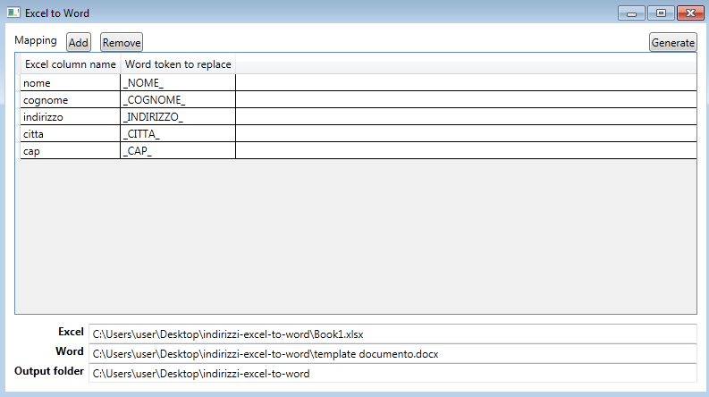
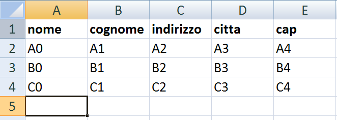
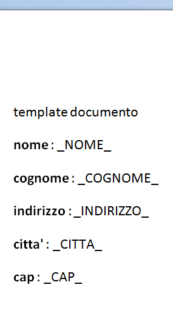
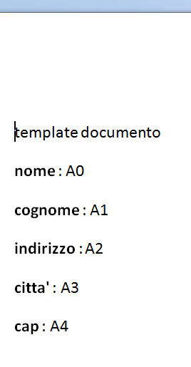
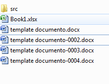

# excel-to-word
generate word files from an excel and a word template

## how it works

- config mapping and paths will be loaded at start and saved at exit
- set your own mapping excel (column name) to word (token to replace) in the datagrid by using Add/Remove buttons
- set excel datasource pathfilename
- set word template pathfilaneme
- set output folder

- press generate

- it generate in the output folder a file with the same name of the template and with -XXXXX.docx appended where XXXXX=excel row number

## prerequisites

- excel input dataset must xlsx format
- word template must docx format

## screenshoots

**main window**

**excel input datasource**

**word template**

**output from 1th row**

**generated files**

